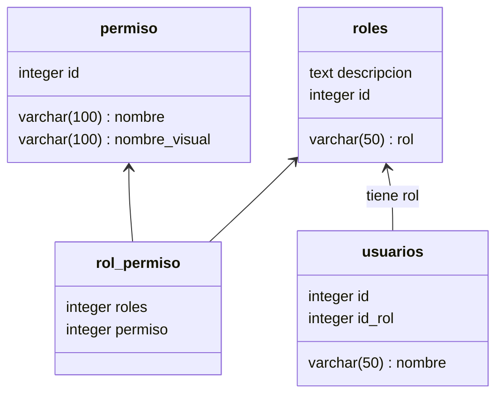

## Manejo de roles y permisos Pt I

### Diagrama de entidad relación de las tablas 

En una web no siempre todas las funcionalidades deben estar disponibles para cualquier usuario final y si ese es tu caso te sugiero que leas las tres partes de **Manejo de roles y permisos**, para conocer como insertar permisos en la tabla para permisos al iniciar el servidor y como asignar permisos a funcionalidades.

Este es el diagrama de entidad relación que utilicé para crear roles dinámicos, asignar una funcionalidad a un permiso específico y luego de definidas todas las funcionalidades crear roles con los permisos necesarios. 

* Diagrama de las tablas

Para el manejo de la relación muchos a muchos entre la tabla roles se creó la tabla intermedia rol_permiso, cada valor que contenga solo se generará cuando a un rol se le asignen permiso/s y así mantenerlas tablas sincronizadas. 

*Si tienes dudas sobre el manejo de las relaciones en SQLAlchemy puedes consultar mi guía **SQLAlchemy Definición de relaciones**. Para el manejo de la relación mucho a muchos entre roles y permisos.*