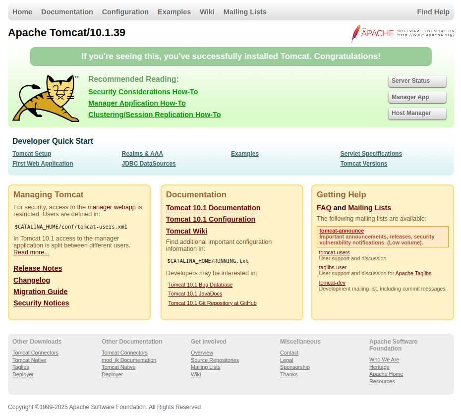

# Montaje Básico de Servidor Tomcat en Debian


## Prerrequisitos
- OpenJDK >= 11.0.0 (`apt install default-jdk`)
- Permisos de `sudo`

## Instalación
0. Cambiar a usuario root (Opcional, puesto que todas las operaciones que se harán requieren privilegios)
```sh
sudo su
```
1. Descargar el tomcat (se recomienda hacerlo desde el sitio oficial, puede que la URL del recurso que ponga aqui ya no exista):
```sh
wget https://dlcdn.apache.org/tomcat/tomcat-10/v10.1.39/bin/apache-tomcat-10.1.39.tar.gz
```
2. Crearse un usuario sin privilegios para correr el tomcat como `daemon`del sistema:
```sh
useradd -m -d /opt/tomcat -U -s /bin/false tomcat
```

>Nota: A partir de este punto me referiré a `/opt/tomcat` como `$TOMCAT_HOME`

3. Extrae ahora el archivo descargado en la carpeta `home` del usuario creado:
```sh
tar xfvz apache-tomcat-10.1.39.tar.gz -C $TOMCAT_HOME --strip-components=1
```

4. Otórgale permisos de ejecución al usuario `tomcat` así como darle el *ownership* de su carpeta `home`:
```sh
chown -R tomcat:tomcat $TOMCAT_HOME
chmod -R u+x $TOMCAT_HOME/bin
```
## Configuraciones básicas dentro del servidor
En el `$TOMCAT_HOME/conf/tomcat-users.xml`  están las configuraciones de control de acceso de las *webapps* de `Manager` y `Host Manager`, usadas para la GUI de administración del Tomcat.
Para acceder a estos servicios, así como por ejemplo, usar plugins de integración con Tomcat en nuestros IDE más adelante con `tomcat7-maven-plugin` es necesario tener permisos a los recursos de estas aplicaciones. ^68ef65
1. Abre el `$TOMCAT_HOME/conf/tomcat-users.xml`, si lees los comentarios (que debe tener) te explicará los diferentes roles que se pueden definir para asignarle a los usuarios, así como los privilegios que tiene cada uno, lo normal es definir uno de **manager** y otro de **superusuario**, ignorando los comentarios del archivo, debería quedar algo así:
```xml
<tomcat-users xmlns="http://tomcat.apache.org/xml"
              xmlns:xsi="http://www.w3.org/2001/XMLSchema-instance"
              xsi:schemaLocation="http://tomcat.apache.org/xml tomcat-users.xsd"
              version="1.0">
  <role rolename="manager-script" />
  <role rolename="manager-gui" />
  <user username="manager" password="changeme" roles="manager-gui,manager-script" />

  <role rolename="admin-gui" />
  <user username="admin" password="changeme" roles="manager-gui,manager-script,admin-gui" />
  
  <!-- muchisimos comentarios explicando como hacer este archivo -->
  
</tomcat-users>
```
2. Por defecto Tomcat restringe todo el acceso a estas webapps, a menos que provenga la conexión del propio servidor (localhost), si estas en alguna VM, clúster, contenedor, etc., o sea, un host diferente al del servidor, puede que te interese cambiar este comportamiento.
	0. Me referire a las webapps como `$WEBAPP`, para `host-manager`y `manager`
	1. Para cada una de las *webapps* Edita el archivo `$TOMCAT_HOME/webapps/$WEBAPP/META-INF/context.xml
	2. Ajusta la etiqueta `<Valve ... />` según tus necesidades, permitiendo solo los orígenes deseados dentro de la propiedad `allow=`, separando los orígenes con `|`, o comentarea las líneas que corresponden a dicha etiqueta (no recomendado en entornos públicos o inseguros).
## Estableciendo Tomcat como servicio del `systemd`
Este parte solo configúrala si deseas tener a tomcat en segundo plano, y siendo gestionada por el sistema, en el arranque.
0. Copia la ruta que mostrará la ejecución de este comando, en la 3ra columna:
```sh
update-java-alternatives -l
```
	Debe mostrar algo así: /usr/lib/jvm/java-1.17.0-openjdk-amd64
	Me referiré a esa ruta como $JDK_PATH en los siguientes pasos
1. Dentro del `/etc/systmed/system` usando crea y edita el archivo `tomcat.service`, añadele estas líneas:
```toml
[Unit]
Description=Tomcat
After=network.target

[Service]
Type=forking

User=tomcat
Group=tomcat

Environment="JAVA_HOME=$JDK_PATH"
Environment="JAVA_OPTS=-Djava.security.egd=file:///dev/urandom"
Environment="CATALINA_BASE=/opt/tomcat"
Environment="CATALINA_HOME=/opt/tomcat"
Environment="CATALINA_PID=/opt/tomcat/temp/tomcat.pid"
Environment="CATALINA_OPTS=-Xms512M -Xmx1024M -server -XX:+UseParallelGC"

ExecStart=/opt/tomcat/bin/startup.sh
ExecStop=/opt/tomcat/bin/shutdown.sh

RestartSec=10
Restart=always

[Install]
WantedBy=multi-user.target
```

	En esa configuración lo que hiciste fue definir a TOMCAT como servicio con sus propios scripts de arraque y apagado, las variables de entorno, y el límite de memoria que puede usar.
2. Reinicia el `daemon`del sistema para que actualice sus servicios:
```sh
systemctl daemon-reload
```
3. Habilita el servicio para que arranque con el sistema, y luego córrelo:
```sh
systemctl enable tomcat && systemctl start tomcat
```
4. Verifica el servicio que esté correctamente funcionando:
```sh
systemctl status tomcat
```
	Debería salir algo así:
	● tomcat.service - Tomcat
	 Loaded: loaded (/etc/systemd/system/tomcat.service; enabled; preset: enabled)
	 Active: active (running) since Sat 2025-03-08 17:07:08 CST; 1h 22min ago
	Process: 200609 ExecStart=/opt/tomcat/bin/startup.sh (code=exited, status=0/SUCCESS)
	   Main PID: 200616 (java)
	      Tasks: 36 (limit: 9113)
	     Memory: 189.6M
	        CPU: 16.672s
	     CGroup: /system.slice/tomcat.service
	             └─200616 /usr/lib/jvm/java-1.11.0-openjdk-amd64/bin/java -Djava.util.logging.
5. En caso que tengas activado el firewall por defecto del sistema `ufw` dale permiso al puerto 8080, que es donde corre por defecto tomcat:
```sh
ufw allow 8080
```
## Probando el servicio
Llegados a este punto si todo salió bien al, en el navegador, entrar a la URL `http://<tu-ip-probably-localhost>:8080` se debería ver la página de bienvenida de Tomcat, donde a la derecha se ven tres botones, entre ellos las webapps de las que se hablaron anteriormente, `manager`y `host-manager`:

Al entrar a cualquiera de estas webs, tocando sus respectivos botones te pedirán las credenciales que [configuraste anteriormente](#^68ef65), éntralas y ya puedes empezar a desplegar tus aplicaciones programadas usando Jakarta EE 9.
