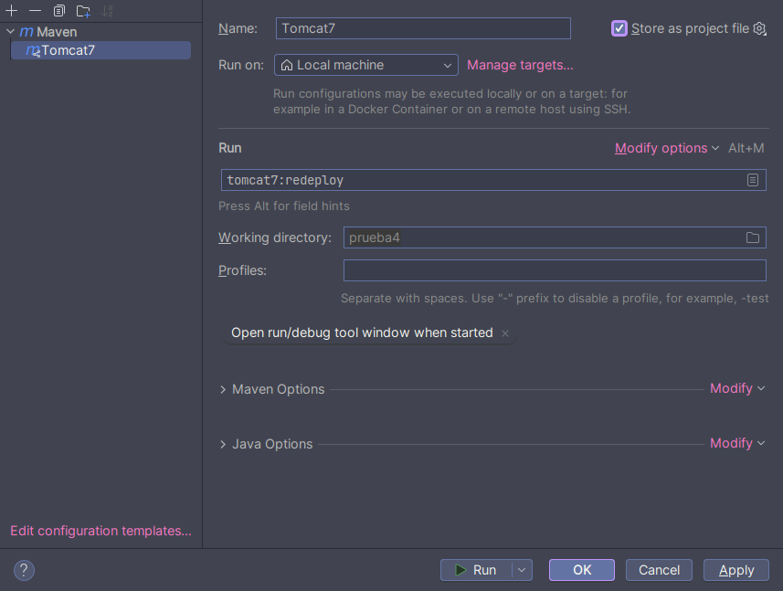

# Crear proyecto Jakarta EE, e integrándolo con servidor Tomcat, usando Maven

## Requisitos previos
- Acceso a un servidor Tomcat >= v7 en ejecución.
- Al menos un usuario con el rol de **manager-script** en el servidor Tomcat, y acceso a sus credenciales.
- JDK >= v8.
- Algún IDE, preferiblemente IntellijIdea.

## Procedimiento
1. Usando el propio IDE, crea un proyecto con Maven (en este caso se usa IntellijIdea Ultimate):

   - Selecciona en la pestaña de **Generators** la opción de **Jakarta EE**.

   - Escoge la *Template* de **Web Application**, esta generará la siguiente jerarquía de archivos:
     ```fcku
     .
     ├── pom.xml
     └── src
         └── main
             ├── resources
             └── webapp
                 ├── index.jsp
                 └── WEB-INF
                     └── web.xml
     
     6 directories, 3 files
     ```

   - En ese mismo menú escribe todas las especificaciones del proyecto: ruta, artefactID, groupId, etcétera.

2. Modificar el `pom.xml`:

   - Inicialmente el archivo debe tener este contenido:

     ```xml
     <project xmlns="http://maven.apache.org/POM/4.0.0" xmlns:xsi="http://www.w3.org/2001/XMLSchema-instance"
       xsi:schemaLocation="http://maven.apache.org/POM/4.0.0 http://maven.apache.org/maven-v4_0_0.xsd">
       <modelVersion>4.0.0</modelVersion>
       <groupId>cu.ndizz.dev</groupId>
       <artifactId>prueba4</artifactId>
       <packaging>war</packaging>
       <version>1.0-SNAPSHOT</version>
       <name>prueba4 Maven Webapp</name>
       <url>http://maven.apache.org</url>
       <dependencies>
         <dependency>
           <groupId>junit</groupId>
           <artifactId>junit</artifactId>
           <version>3.8.1</version>
           <scope>test</scope>
         </dependency>
       </dependencies>
       <build>
         <finalName>prueba4</finalName>
       </build>
     </project>
     
     ```

     - De manera rápida, este archivo ahora mismo solo ofrece el modulo para realizar unittesting, por lo que debemos agregarlo casi todo nosotros mismos, si no pretendes hacer pruebas unitarias en tu proyecto puedes borrar el bloque de código de la dependencia `junit`:

       ```xml
       ...    
       	<dependency>
             <groupId>junit</groupId>
             <artifactId>junit</artifactId>
             <version>3.8.1</version>
             <scope>test</scope>
           </dependency>
       ...
       ```

   - En la sección de dependencias `<dependencies>` agregaremos la [API de Jakarta EE 9.0.0](https://mvnrepository.com/artifact/jakarta.platform/jakarta.jakartaee-api/9.0.0):

     ```xml
     ...
         <dependency>
             <groupId>jakarta.platform</groupId>
             <artifactId>jakarta.jakartaee-api</artifactId>
             <version>9.0.0</version>
             <scope>provided</scope>
         </dependency>
     ...
     ```

   - En los plugins dentro de `<build>` agregamos el plugin del empaquetador y el compilador de Maven, y el plugin de integración de Jakarta EE con Tomcat, en ese orden respectivamente (sustituye los campos de `url`, `username`, `password` por tus valores reales):

     ```xml
     ...
         <build>
             <plugins>
             	...
               	<plugin>
                     <groupId>org.apache.maven.plugins</groupId>
                     <artifactId>maven-war-plugin</artifactId>
                     <version>3.4.0</version>
     			</plugin>
                 <plugin>
                     <groupId>org.apache.maven.plugins</groupId>
                     <artifactId>maven-compiler-plugin</artifactId>
                     <version>3.8.0</version>
     			</plugin>
                 <plugin>
                     <groupId>org.apache.tomcat.maven</groupId>
                     <artifactId>tomcat7-maven-plugin</artifactId>
                     <version>2.2</version>
                     <configuration>
                       <url>http://localhost:8080/manager/text</url>
                       <username>robot</username> // bot-username
                       <password>password</password> // bot-pass
                     </configuration>
     			</plugin>
             </plugins>
         </build>
     ...
     ```

3. Agregar configuración de arranque al proyecto en el IDE (esto puede variar en otro, pero la lógica siempre será la misma) :

   - En Intellijidea:

     1.  En la barra del menú del Intellijidea, desplegamos el menú de `Run`.

     2. Tocamos en `Edit configurations` y luego en `Add new...` o en el botón de `+`.

     3. Al desplegarse un grupo de opciones buscamos y tocamos la opción de `Maven`.

     4. Le ponemos a la configuracion como querramos, en mi caso le puse *Tomcat7*.

     5. En el campo que dice *Run*, escribimos:

        ```
        tomcat7:redeploy
        ```

        - Esto le dice a Maven que cada vez que se compile re-despliegue el WAR en Tomcat, con los nuevos cambios aplicados.

     6. (Opcional) Marcamos la checkbox que dice **Store as project file**, así se guarda en el proyecto, y en el control de versiones.

     7. Debe haber quedado algo así:

        

4. Luego de esto, si todo salió bien, ya tendremos una opción de Ejecutar en el proyecto, así que le daremos ahí.

Ya para este punto la aplicación debería haber sido desplegada en Tomcat, visita el servidor, con el nombre de tu proyecto, para ver tu Web, la URL es algo así (*prueba4* es como le puse a mi proyecto de muestra):

- http://localhost:8080/prueba4

